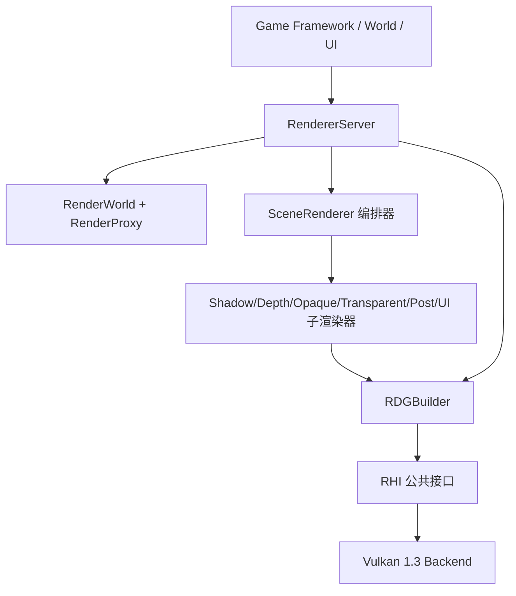

# SeedEngine RenderGraph(RDG) 与渲染交换数据格式设计文档

> 本文是 Renderer 层新增设施的权威说明, 与代码同步维护.
> 配套代码位置(相对 `sources/engine/runtime/renderer/`):
>
> | 模块 | 头文件 | 实现 |
> |---|---|---|
> | RDG 基础设施 | `includes/rdg/RDGBuilder.hpp` | `sources/rdg/RDGBuilder.cpp` |
> | 渲染交换格式 | `includes/renderer/RenderData.hpp` | —(纯头) |
> | 渲染世界/代理 | `includes/renderer/RenderWorld.hpp` | `sources/RenderWorld.cpp` |
> | 子渲染器抽象 | `includes/renderer/RenderPass.hpp` | —(纯头) |
> | 场景渲染器编排 | `includes/renderer/SceneRenderer.hpp` | `sources/SceneRenderer.cpp` |
> | UI 渲染器 | `includes/renderer/UIRenderer.hpp` | `sources/UIRenderer.cpp` |
> | 渲染服务门面 | `includes/renderer/RendererServer.hpp` | `sources/RendererServer.cpp` |
>
> 另见 `sources/engine/modules/generic_application/includes/generic_application/widget/RenderTree.hpp`
> (控件树 `RenderCommand` 扩展了纹理/文字).

---

## 0. 目标、边界与分层

本文描述 Renderer 层在 RHI 之上建立的三件事, 解决"RHI 已成熟但 Renderer 只有单 Pass"的问题:

1. **RDG(RenderGraph)**: 多 Pass 一帧的编排、资源生命周期、自动 barrier 与 rendering scope.
2. **渲染交换数据格式**: 3D(`DrawPacket`) 与 2D/UI(`UIQuad`/`UIRenderBatch`) 的统一数据协议.
3. **细粒度子渲染器 + 增量意图**: 参考 UE, 把一帧拆成只做一类事的子渲染器, 最后合并到同一 RDG.

### 0.1 分层(依赖只能向下)



### 0.2 命名原则(重要)

- 渲染模块里**不出现 "Scene" 这个名词** —— "场景" 是 Game Framework 的概念.
  渲染器侧只有:
  - `RenderProxy`(单个可渲染对象的代理, 对应 UE 的 `FPrimitiveSceneProxy`);
  - `RenderWorld`(所有代理的聚合, 对应 UE 的 `FScene`).
- 可渲染组件 `RenderComponent` 属于 **Game Framework**, 它是 `RenderProxy` 的生产者/持有者,
  渲染器只只读消费 `RenderProxy`. (一个可能的更高效率方案: 各 `RenderComponent` 的代理与
  World/Engine 持有的"总渲染代理"交互、由总代理统一提交 —— 该决策在 Game Framework 侧, 待商榷.)

---

## 1. RDG 基础设施

### 1.1 三段式编排

```cpp
RDGBuilder builder(device);

auto backbuffer = builder.importImage(image, view, "Backbuffer", /*InitialState*/ rhi::EResourceState::Present);

builder.addGraphicsPass("Opaque",
    [&](RDGPassBuilder& p) {
        auto depth = p.createTexture({...}, "SceneDepth");     // transient, 同名跨帧复用
        p.depthStencil(depth, rhi::ELoadOp::Clear, rhi::EStoreOp::Store);
        p.renderTarget(backbuffer, rhi::ELoadOp::Clear, rhi::EStoreOp::Store);
    },
    [&](RDGExecuteContext& ctx) {
        ctx.getCommandList().drawIndexed(...);                   // 已在 rendering scope 内
    });

builder.compile();
builder.execute(commandList);
builder.clear();   // 进入下一帧(保留 transient 缓存)
```

### 1.2 关键语义

- **Pass 按声明顺序执行**(v1), 不做拓扑排序/裁剪/别名.
- **资源状态追踪**: 每个资源记录 `LastState` 与 `LastAccessWasWrite`, 据此在 Pass 前自动生成:
  - 状态变化 → `ImageBarrier`/`BufferBarrier`(布局转换);
  - 同状态 RAW/WAR/WAW → `GlobalBarrier`(仅内存可见性).
- **附件自动包裹**: Graphics Pass 声明了 `renderTarget`/`depthStencil`, execute 时自动
  `beginRendering`/`endRendering`; Compute/Copy 无渲染作用域.
- **transient 复用**: 同名 + 同描述的 `createTexture`/`createBuffer` 跨帧复用物理 RHI 句柄.
- RDG 只生成 RHI 公开的 `GlobalBarrier/BufferBarrier/ImageBarrier`, 不触碰原生 Vulkan.

### 1.3 当前边界(诚实声明)

单 Graphics 队列; 无死代码裁剪 / Pass 合并 / 别名堆 / 拓扑排序;
导入资源的首个访问若用 `Load`, 需正确传入 `InitialState`(否则用 `Clear`/`DontCare`).

---

## 2. 渲染交换数据格式(`RenderData.hpp`)

### 2.1 变更标志(增量渲染意图)

```cpp
enum class EChangeFlags_t : uint32_t {
    None, Transform, Material, Geometry, Visibility, Light, Camera, Layout, Content, All
};
using EChangeFlags = core::Flags<EChangeFlags_t>;
```

### 2.2 3D: `DrawPacket` / `DrawList`

不可变"一次绘制"描述(Pipeline + BindGroups + VB/IB + PushConstant + 绘制参数 + SortKey),
不持有场景/材质系统引用, 可并行收集、排序、缓存. 子渲染器只消费 packet.

### 2.3 2D/UI: `UIQuad` / `UIRenderBatch`

`UIQuad`(屏幕包围盒 + UV + 预乘颜色 + 纹理索引 + Layer)与 `UIRenderBatch`(同纹理+透明合并).
纹理引用用整数索引, 使 UI 层与 RHI 解耦.

---

## 3. 渲染世界与渲染代理(`RenderWorld.hpp`)

### 3.1 数据模型

```cpp
struct StaticMesh {  // VB/IB + 顶点布局 + 包围球(渲染器侧共享几何) };
struct RenderProxy { // 一个可渲染对象的代理: Mesh + MaterialId + LocalToWorld + 绘制策略 };
class RenderWorld {  // 所有代理的聚合: addProxy/removeProxy/update*/collectVisible + 变化意图 };
```

### 3.2 渲染意图(增量)

- `RenderWorld::markChanged(Flags)` 累积; `consumeChangeFlags()` 帧首读取并清零.
- `collectVisible(Out)` 产出 `VisibleProxy{ ProxyIndex, SortKey }` 并按 SortKey 稳定排序.

**RenderProxy -> DrawPacket** 的转换由 MaterialSystem/RenderScene 负责(依据 `MaterialId`
解析管线/绑定组), 使 RenderWorld 与材质系统解耦.

### 3.3 增量策略

| 变化 | 重建范围 |
|---|---|
| `Transform` | 只重传实例变换 |
| `Material` | 只重建受影响实例的 BindGroup |
| `Geometry` | 重建 VB/IB |
| `Camera`/`Visibility` | 重新剔除排序 |
| 无 | 复用上一帧 |

---

## 4. 细粒度子渲染器(`RenderPass.hpp` + `SceneRenderer.hpp`)

### 4.1 抽象

```cpp
struct RenderView { View; Projection; ViewProjection; CameraPosition; };
struct RenderFrameResources { RDGResourceId SceneDepth; /* 未来 GBuffer/SceneColor/HiZ */ };
struct RenderContext { World; View; UI; Backbuffer; FrameResources&; FrameIndex; Width; Height; };

class IRenderPass {
    virtual const char* getName() const = 0;
    virtual void addPasses(RDGBuilder&, const RenderContext&) = 0;
};
```

### 4.2 具体子渲染器(参考 UE 的 Pass 顺序)

| 子渲染器 | 职责 |
|---|---|
| `ShadowRenderPass` | 阴影深度 |
| `DepthPrePass` | 主深度预通道(声明共享 `SceneDepth`) |
| `OpaqueRenderPass` | 不透明(读 `SceneDepth`) |
| `TransparentRenderPass` | 半透明 |
| `PostProcessRenderPass` | 后处理 |
| `UIRenderPass` | 2D/UI 合成(消费 `UIRenderer` 合批) |

### 4.3 合并(UI 与 3D 汇入同一 RDG)

`SceneRenderer`(对应 UE 的 `FDeferredShadingSceneRenderer`)依次驱动所有子渲染器, 每个子渲染器
都向**同一个** `RDGBuilder` 声明 Pass; `RendererServer::renderFrameGraph` 最后统一 `compile()` +
`execute()`. 因此 UI(`UIRenderPass`)与 3D(其余子渲染器)即使内部实现不同, 最终也合并进同一张图、
同一条命令流.

> v1 状态: 各子渲染器的 `addPasses` 已声明正确的 Pass 结构与附件/读写依赖(架构骨架),
> `Execute` 内实际绘制留空 —— 需 MaterialSystem 完成 `RenderProxy -> DrawPacket` 的管线解析、
> 以及 UIRenderer 批次的顶点上传与 2D 管线后填充.

---

## 5. RendererServer 接口

```cpp
// 历史兼容: 单渲染作用域 + 用户回调
using FrameRecorder = std::function<void(rhi::RCommandList&, const std::shared_ptr<rhi::RImageView>&, uint32_t, uint32_t)>;
EFrameStatus renderFrame(const FrameRecorder& Recorder = {});

// 推荐: RDG 多 Pass, 交换链图作为 Backbuffer 参数传入
using FrameGraphSetup = std::function<void(RDGBuilder&, RDGResourceId Backbuffer)>;
EFrameStatus renderFrameGraph(const FrameGraphSetup& Setup = {});

RenderWorld& getRenderWorld() noexcept;
UIRenderer& getUIRenderer() noexcept;
```

典型 3D + UI 帧(用 `SceneRenderer` 合并):

```cpp
SceneRenderer sceneRenderer;
sceneRenderer.addPass(std::make_unique<ShadowRenderPass>());
sceneRenderer.addPass(std::make_unique<DepthPrePass>());
sceneRenderer.addPass(std::make_unique<OpaqueRenderPass>());
sceneRenderer.addPass(std::make_unique<TransparentRenderPass>());
sceneRenderer.addPass(std::make_unique<PostProcessRenderPass>());
sceneRenderer.addPass(std::make_unique<UIRenderPass>());

RendererServer::self().renderFrameGraph([&](RDGBuilder& b, RDGResourceId backbuffer) {
    RenderFrameResources frameResources;
    RenderContext ctx {
        .World = RendererServer::self().getRenderWorld(),
        .View = view,
        .UI = RendererServer::self().getUIRenderer(),
        .Backbuffer = backbuffer,
        .FrameResources = frameResources,
        .Width = W, .Height = H,
    };
    sceneRenderer.build(b, ctx);   // 3D + UI 全部声明进同一张图
});
```

---

## 6. UI 增量与合批(`UIRenderer`)

- `ui::RenderTree` 的 `RenderCommand` 扩展 `TextureId`/`Text`/`Layer`(不持有 RHI).
- `UIRenderer`(纯 CPU, 无 RHI)把 `ui::RenderNode` 树递归转 `UIQuad`(颜色预乘 alpha), 按
  `(Layer, TextureIndex)` 稳定排序后聚合为 `UIRenderBatch`.
- `submit`(全量) / `submitIncremental`(增量接口, v1 退化为全量重批, 为脏矩形+离屏 Canvas 预留).
- 文本需 `FontAtlas` 提供 Glyph UV; v1 跳过非空 `Text` 命令(占位).

---

## 7. 落地顺序与后续路线

已完成(v1):

1. RDG 三段式编排 + 状态追踪 + barrier 生成 + transient 名称缓存;
2. `DrawPacket`/`UIQuad`/`UIRenderBatch`/`EChangeFlags` 交换格式;
3. `RenderWorld` + `RenderProxy`(UE FScene/FPrimitiveSceneProxy 对齐) + 变化意图;
4. `IRenderPass` 子渲染器抽象 + `SceneRenderer` 编排 + 六个具体子渲染器骨架;
5. `UIRenderer` 控件树→合批 + 增量接口;
6. `RendererServer::renderFrameGraph`(Backbuffer 参数化) + `getRenderWorld`/`getUIRenderer`.

后续路线(按依赖):

1. `FrameUploader`(Upload Ring) 与 `ReadbackPool`;
2. MaterialSystem 接入: `RenderProxy -> DrawPacket` 的管线/绑定组解析, 填充子渲染器 Execute;
3. UI 的 2D 管线 + 顶点上传 + `FontAtlas` 文本;
4. RDG 拓扑排序、死代码裁剪、transient 别名堆;
5. 视锥/遮挡剔除 + GPU Culling + Indirect Draw;
6. 多队列调度 + ownership transfer + RenderThread + Secondary 并行录制.

> 注意: 项目存在两个与本文无关的既有构建问题 —— `sources/engine/runtime/engine/CMakeLists.txt`
> 引用不存在的 `Runtime::World` 模块(CMake 配置失败); 以及 `assets/` 目录缺失(Launcher 的
> POST_BUILD 资源拷贝失败). 本文代码本身已通过 `Renderer` 目标编译验证(在临时移除
> `Runtime::World` 引用后编译通过).
